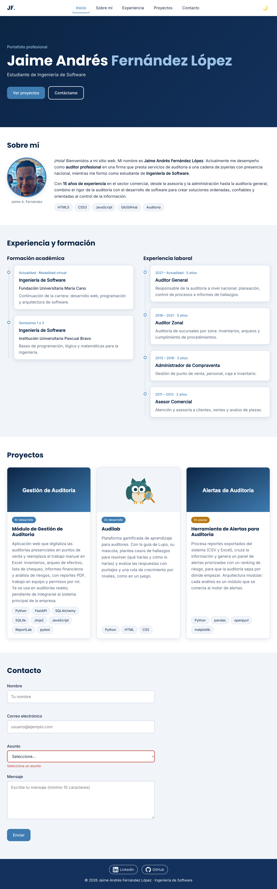
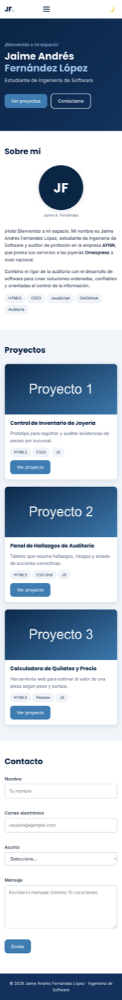

# Mi Portafolio Web Interactivo

Portafolio personal de **Jaime Andrés Fernández López**, estudiante de Ingeniería de Software y auditor profesional. Actividad integradora de la Unidad 1 – Lenguaje de Programación para la Web.

## Tecnologías
- HTML5 semántico
- CSS3 (Flexbox, Grid, variables, mobile-first con 3 breakpoints)
- JavaScript vanilla (DOM, eventos, `localStorage`)
- Git y GitHub Pages

## Funcionalidades
- Menú hamburguesa responsive
- Carga dinámica de proyectos desde un array de objetos
- Validación de formulario en tiempo real (envío simulado)
- Tema claro/oscuro persistente
- Animaciones de aparición al hacer scroll

## Estructura
```
mi-portafolio/
├── index.html
├── css/ (reset, variables, layout, components)
├── js/  (main, form-handler, animations)
└── assets/ (images, icons)
```

## Ejecución local
1. Clona el repositorio.
2. Abre `index.html` en el navegador, o ejecuta `python3 -m http.server` y visita `http://localhost:8000`.

## Capturas de pantalla
### Escritorio


### Móvil


**Sitio en vivo:** https://jaanferlop.github.io/miportafolio/

## Autor y licencia
Jaime Andrés Fernández López · Licencia MIT
